# Flutter Screens

A comprehensive collection of beautifully designed Flutter UI screens, buttons, loaders, and widgets ready to be integrated into your applications.

## 🌟 Table of Contents
- [Flutter Screens](#flutter-screens)
  - [🌟 Table of Contents](#-table-of-contents)
  - [🌟 Features \& Upcoming Features](#-features--upcoming-features)
  - [📱 Screenshots](#-screenshots)
    - [Login Screens](#login-screens)
    - [Loaders](#loaders)
  - [🚀 Getting Started](#-getting-started)
  - [🤝 Contributing](#-contributing)
  - [📄 License](#-license)
  - [🏆 Hall of Fame](#-hall-of-fame)
  - [👨‍💻 Author](#-author)

## 🌟 Features & Upcoming Features

| Current Features | Upcoming Features |
|-----------------|------------------|
| ⚫ 6 Different Login Screen Designs | ⚪ More Login/Signup Screen Designs |
| ⚫ Custom Button Components | ⚪ Additional Custom Widgets |
| ⚫ Animated Loaders | ⚪ New Animation Components |
| ⚫ Rating Widget | ⚪ Enhanced UI Components |
| ⚫ SlideListView Widget | ⚪ More List View Variations |
| ⚫ Material Design 3 Support | ⚪ Additional Screen Templates |
| ⚫ Responsive Layouts | ⚪ Profile Screen Designs |
| ⚫ Custom Navigation Drawer | ⚪ Settings Screen Templates |
| ⚫ Animated Bottom Navigation Bar | ⚪ Dashboard Layouts |
| ⚫ Beautiful Cards & Lists | ⚪ E-commerce Screen Designs |
| ⚫ Form Components | ⚪ More Form Widgets |
| ⚫ Progress Indicators | ⚪ Additional Loading Animations |
| ⚫ Custom Dialogs | ⚪ Alert/Dialog Variations |
| ⚫ Onboarding Screens | ⚪ More Onboarding Templates |

## 📱 Screenshots

### Login Screens
<div style="display: flex; justify-content: space-between;">
    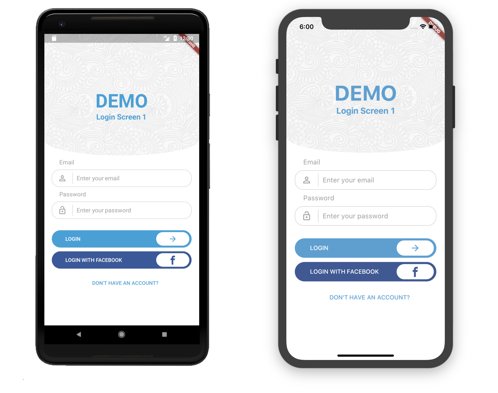
    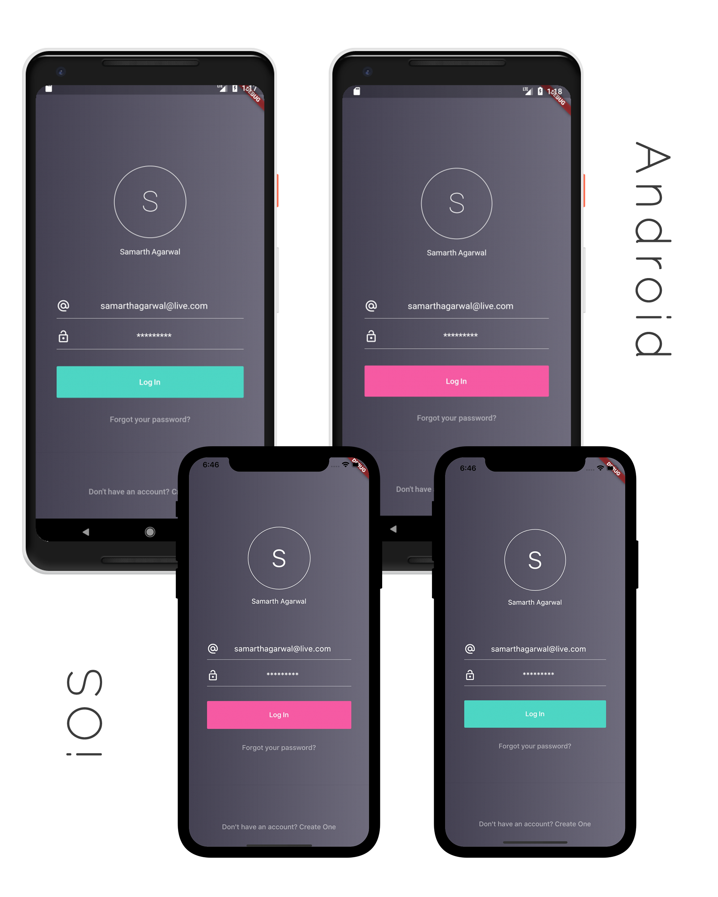
</div>
<div style="display: flex; justify-content: space-between;">
    
    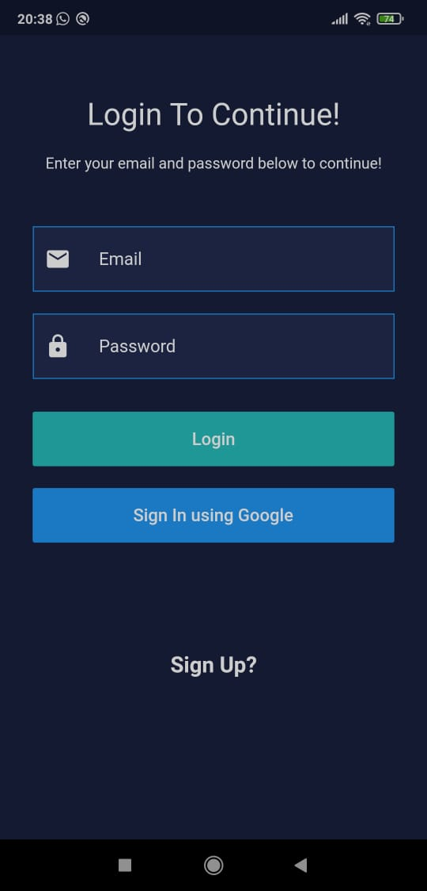
</div>
<div style="display: flex; justify-content: space-between;">
    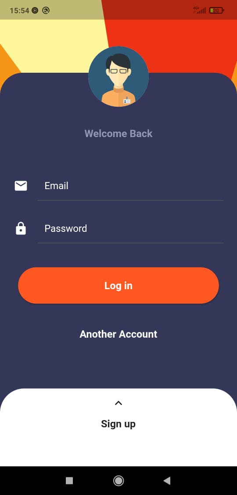
    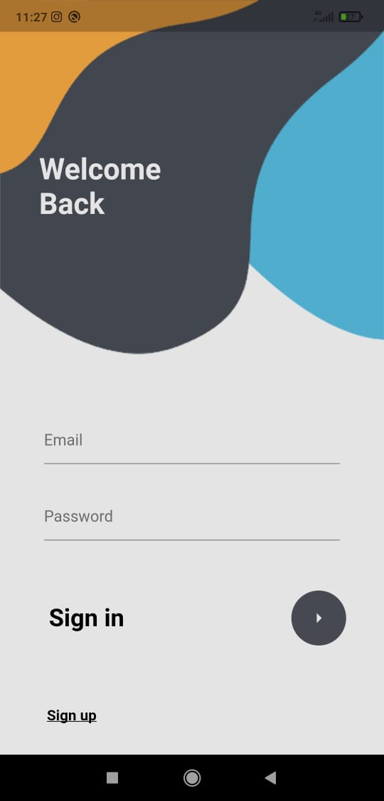
</div>

### Loaders
<div style="display: flex; justify-content: space-between;">
    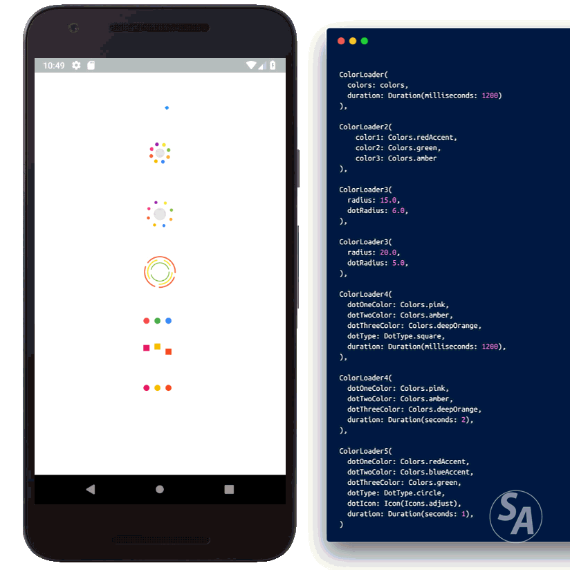
    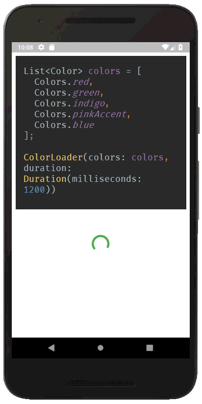
</div>
<div style="display: flex; justify-content: space-between;">
    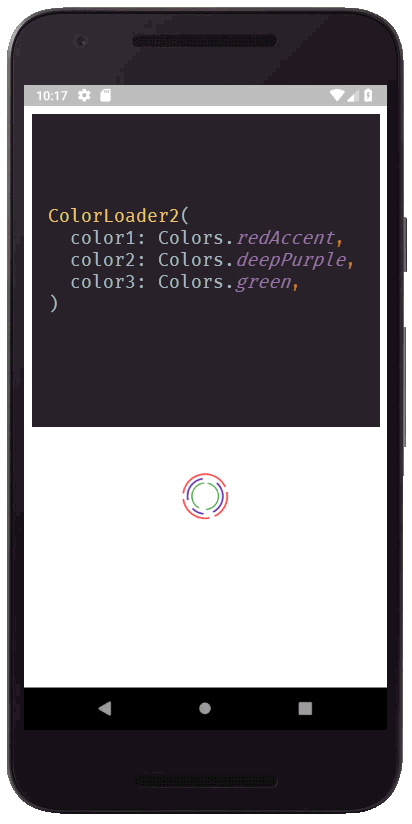
    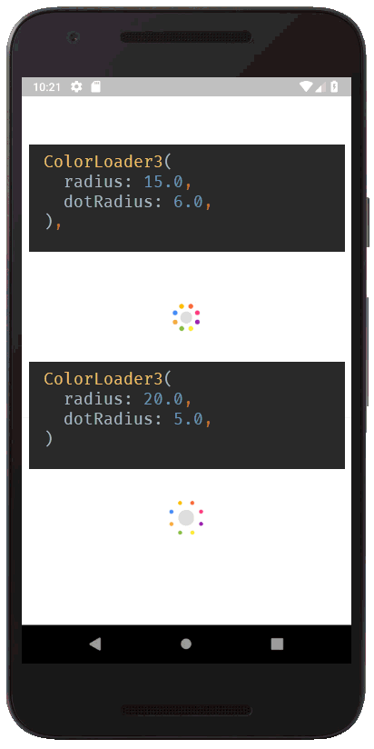
</div>
<div style="display: flex; justify-content: space-between;">
    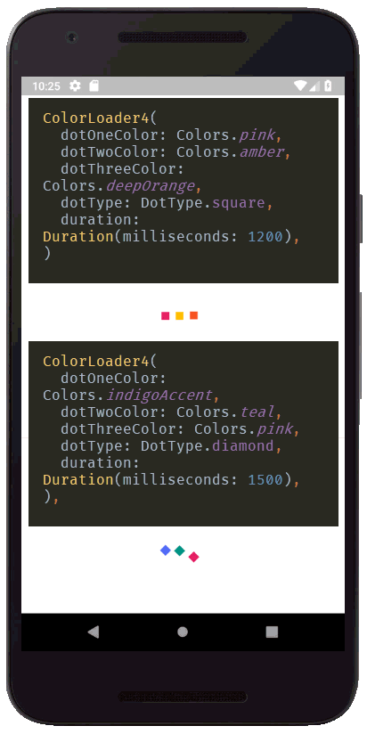
    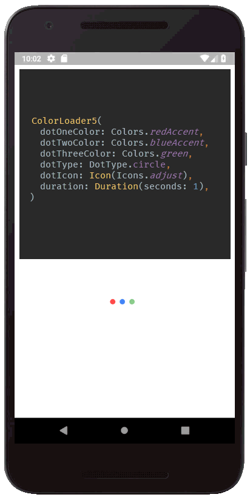
</div>

## 🚀 Getting Started

1. Clone the repository:
   ```bash
   git clone https://github.com/The-Young-Programer/FlutterScreens.git
   ```

2. Navigate to the project directory:
   ```bash
   cd FlutterScreens
   ```

3. Install dependencies:
   ```bash
   flutter pub get
   ```

4. Run the app:
   ```bash
   flutter run
   ```

## 🤝 Contributing

Contributions are welcome! 

Please feel free to submit a Pull Request

For major changes, please open an issue first to discuss what you would like to change.

## 📄 License

This project is licensed under the MIT License - see the [LICENSE](LICENSE) file for details.

## 🏆 Hall of Fame
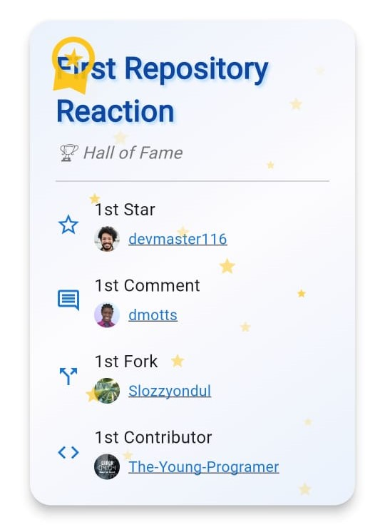

These amazing people were the first to interact with this repository! 

Their early support and contributions helped shape this project into what it is today.

## 👨‍💻 Author

Created with ❤️ by [Nemonet TYP](https://github.com/The-Young-Programer)

<!-- ## 👥 Contributors
- Nemonet TYP
- [Other Contributors](https://github.com/The-Young-Programer/FlutterScreens/graphs/contributors) -->
